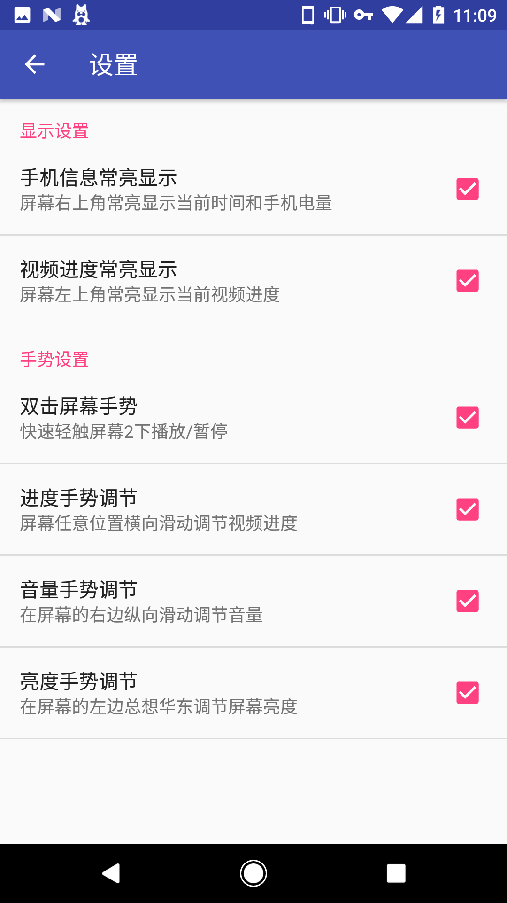

# Video Player
> 简简单单一个视频播放器
> A simple video player

---

### 注意
1. 测试版
2. 测试版
3. 测试版

### 功能
1. 视频播放
2. 双击屏幕暂停 / 播放
3. 左右滑动切换进度
4. 上下滑动设定亮度和音量
5. 手势设置可以及个人喜好关闭
6. 屏幕常亮信息展示(可在设置中关闭)

---

### Attention
1. It's still beta
2. It's still beta
3. It's still beta

### Function
1. Play video
2. Double tap screen to pause / play
3. Horizontally scroll the screen to seek video progress
4. Vertically scroll the screen to set brightness and volume
5. All the gesture can turn off base on your like
6. Video infomation and device infomation always show on screen.(can turn off in setting)

---

#### Language
+ 简体中文 (Simplified Chinese)
+ English (English)
+ 日本語 (Japanese) (Translated by Google Translate)

---

### ScreenShot

